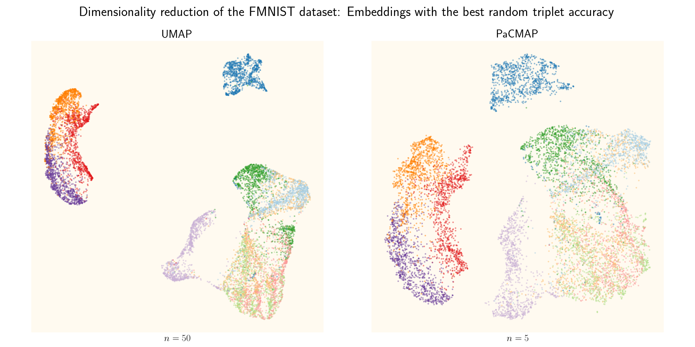

# UMAP vs PaCMAP

This is a dimensionality reduction project in the course *DD2470 Advanced Topics in Visualization and Computer Graphics* at KTH Royal Institute of Technology, Stockholm (2024), made by Linnéa Gustafsson.

## About
This project answers the research question: 

**How does the performance of UMAP compare to PaCMAP in preserving local and global structures? The evaluation will be based on KNN accuracy and SVM accuracy for local structure preservation, and random triplet accuracy and centroid triplet accuracy for global structure preservation.**

The work is heavily inspired by [*Understanding How Dimension Reduction Tools Work: An Empirical Approach to Deciphering t-SNE, UMAP, TriMap, and PaCMAP for Data Visualization* (Wang, Yingfan, et al., 2021)](https://dl.acm.org/doi/abs/10.5555/3546258.3546459), the paper introducing PaCMAP. It is also based on the work that launched UMAP, [*UMAP: Uniform Manifold Approximation and Projection for Dimension Reduction (McInnes, L., Healy, J., & Melville, J., 2018)*](https://arxiv.org/abs/1802.03426).

See a presentation of the project in the [`presentation_slides`](./presentation_slides) folder.

## How to run
The code is run from `main.py`.

## Dependencies
Required packages:

- collections
- json
- matplotlib
- numba
- numpy
- os
- pacmap
- pandas
- pickle
- seaborn
- sklearn
- sys
- tensorflow.keras
- umap-learn

Not all methods in `evaluation.py` are used in this implementation (only `evaluate_output()` and the methods called by it). Feel free to comment out unreached code if you don't want to use it. 

## Datasets
This project uses eight different datasets, of which two (Spiral3D and Circle2D) are custommade by the author:

- Iris
- Digits
- MNIST
- FMNIST
- CIFAR-10
- CIFAR-100
- Spiral3D
- Circle2D

## Credits
This project relies on the work of the above mentioned papers. The code for UMAP, PaCMAP and the evaluation is to a large degree based on their code. 
- [UMAP library](https://umap-learn.readthedocs.io/en/latest/) / [UMAP GitHub repository](https://github.com/lmcinnes/umap)
- [PaCMAP library](https://pypi.org/project/pacmap/) / [PaCMAP GitHub repository](https://github.com/YingfanWang/PaCMAP)

## Authors
[Linnéa Gustafsson](https://github.com/gustafssonlinnea)

## License
According to the used packages.